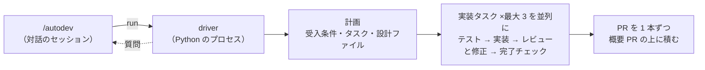

# autodev

指示を 1 つ渡すと、計画・テスト・実装・レビューを経て、GitHub の stacked PR まで人の手を借りずに進める。
**マージはしない。** 積み上がった PR を人がレビューし、下からマージする。



進め方と合否は driver が決める。ステージ（計画・実装・レビューなど）は、driver がそのつど `claude -p`（クラスのエージェントが `codex` なら `codex exec`、`copilot` なら `copilot -p`）を 1 回起動して務めさせる。
作業はタスクごとの git worktree で行い、手元のブランチと作業中のファイルには触らない。
用語・集約・状態の遷移は [DOMAIN.html](DOMAIN.html) にまとめてある（ブラウザで開く）。

## 使い方

Claude Code で `/autodev` と打ち、対象のリポジトリと指示を渡す。スキルが driver を裏で走らせる。
要るのは、ログイン済みの `claude` と、`gh` と `gh stack` 拡張。

人の判断が要ると、driver は質問を出す。スキルがその質問をあなたに渡すので、答えるとそのまま続く。
答えを待つ間も、質問に関係しないタスクは進む。

直接呼ぶときの入口は PATH の `autodev` コマンド。

```bash
autodev run --name <ラン名> --repo <リポジトリ> --instruction-file -   # 始める（指示は標準入力）
autodev run --name <ラン名>                                           # 続きから
autodev status --json --name <ラン名>                                 # 状態
autodev answer --name <ラン名> --question <質問 ID> --answer-file -     # 答える
```

### Codex を使う

クラスごとにエージェントを選べる。既定は `claude`。

```bash
autodev config set --class implement --agent codex --model <codexのモデル名> --effort high
```

- effort は `minimal`・`low`・`medium`・`high`・`xhigh`（claude は `low`〜`max`）。effort が選んだエージェントで使えないと、設定は拒まれる
- `--agent codex` のクラスには `--model` が要る（claude のモデル名は渡らない）。claude に戻すときも claude のモデル名を渡す
- `codex login` を済ませる。ランの始めに `codex` の有無とログインを確かめ、足りなければ起動が失敗する
- **初回だけ**、`agent-toolkit install` の後に Codex の `/hooks` で autodev のフックを信頼する。Codex はフック定義のハッシュで信頼を記録し、信頼するまでフックが走らない。
  信頼がないと、ツールを呼んだのにフックの記録が 0 件になり、ステージが「フックの記録が 0 件」のエラーで落ちる
- ステージのログは `codex exec --json` の JSONL（`thread.started`・`item.completed`・`turn.completed`・`turn.failed`）。拒まれた呼び出しは JSONL に出ず、`<log>.hooks` に残る。標準エラーは `<log>.err`

### Copilot を使う

GitHub Copilot CLI（`copilot`）も、クラスごとに選べる。

```bash
autodev config set --class implement --agent copilot --model <copilotのモデル名> --effort high
```

- `--model` は必須で、`auto` は使えない（大文字小文字を問わず、設定の時点で拒まれる）。claude・codex から切り替えるときも `--model` を渡す
- effort は `none`・`minimal`・`low`・`medium`・`high`・`xhigh`・`max`
- `copilot login` を済ませる。ランの始めに `copilot --version` と、`~/.copilot/config.json`（`COPILOT_HOME` があればそこ）の認証の項目（`authTokens`・`loggedInUsers`）の有無を見る。モデルは呼ばないので、トークンが失効していても気づかず、最初のステージで落ちる
- 環境変数は呼び出し元のものをそのまま渡す（`COPILOT_PROVIDER_*`・`COPILOT_MODEL`・`GH_TOKEN` なども消さず、書き換えない）。autodev が足すのは、ガードの変数とフックの記録（`AUTODEV_HOOK_RECORD`）だけ
- ラン専用の `COPILOT_HOME` は作らない。呼び出し元の `COPILOT_HOME`（無ければ `~/.copilot`）をそのまま使うので、個人の MCP・プラグイン・設定も効く。autodev のガードは `--plugin-dir` のプラグインで足す
- 利用枠の上限で、別モデルへも auto へも切り替えず、ランを止める（終了コード 3）。上限と見なすのは `session.error` の `errorType` が `rate_limit`・`quota` のものと、`auto_mode_switch.requested`
- Copilot には出力の形を縛る旗が無い。プロンプトの末尾に出力スキーマを置き、最後のメッセージの末尾で閉じる JSON の object を結果として読む（```json の囲みと前置きは外す）。形が違えば、ほかのエージェントと同じく、同じセッションに違う所を伝えて返し直させる
- ステージのログは `copilot -p --output-format json` の JSONL。フックに拒まれた呼び出しは、JSONL に `tool.execution_complete`（`error.code` が `denied`）として出る。拒んだ理由と控えた ask は `<log>.hooks` に残る。標準エラーは `<log>.err`

制約:

- 認証の写しは、`config.json` に認証の項目がある環境で確かめた。OS の資格情報ストアを使う環境では未検証
- フックの時間切れ（600 秒）では、操作が通りうる。専用の対策はしていない
- 上限のイベントの形は、Copilot CLI に同梱のイベントの型定義から取った。実際に上限に当てては確かめていない。別の形で出ると、ランは止まらず、ステージの失敗として扱われる

## 終了コード

| コード | 意味 | 次にすること |
| --- | --- | --- |
| 0 | ランを終えた（全部積んだとは限らない） | `status --json` で積んだタスクと止めたタスクを見る |
| 1 | 起動できなかった | 標準エラーの理由を直して呼び直す |
| 3 | 途中で止まった（利用枠の上限・SIGINT など） | 原因が消えたら `run --name` で続きから |
| 4 | 回答待ちで、進められるタスクが無い | 答えてから `run --name` で続きから |
| 5 | `status --name` で、そのランが無い（events.db が無い） | ラン名を確かめる。起動の直後なら少しおいて取り直す |

## 置き場

| 置き場 | 中身 |
| --- | --- |
| `~/.local/state/autodev/<ラン名>/` | ランの記録（`events.db`・質問・ログ・worktree） |
| `~/.config/autodev/repos/<スラッグ>.json` | リポジトリごとの設定（`quickChecks`（軽い検査）・`regressionTests`（回帰テスト）・`testGlobs`（テストのパス）・`protected`（変更禁止のパス）・`untested`（テストの要らないパス））。人が書く。無くても走る。古い鍵 `verify` は読まれず、起動が失敗する。`regressionTests` に改名し、速いものは `quickChecks` に分ける |
| `~/.config/autodev/models.json` | クラス（lead・review・implement・write）ごとのエージェント（claude・codex・copilot）・モデル・effort。`autodev config set` で書く。書いた欄だけが既定を上書きし、次に始めるランから効く。無くても走る |

## 片付け

| コマンド | 消すもの |
| --- | --- |
| `autodev clean --name <ラン名>` | worktree だけ。記録は残す |
| `autodev purge --name <ラン名>` | worktree・手元のブランチ・記録。PR とリモートのブランチは残る |

## しないこと

- マージしない。概要 PR は全部積み終わるまで draft のまま
- 対象のリポジトリにファイルを足さない。記録も設定もリポジトリの外に置く
- ステージには GitHub を触らせない。push と PR は driver が行う
