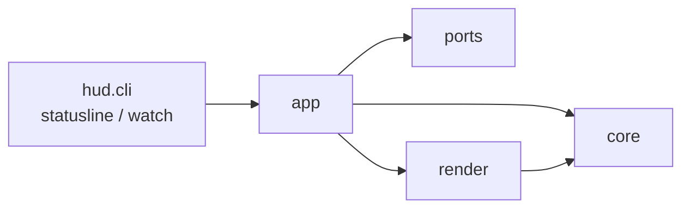

# Claude Code configuration and autodev

## Claude Code (`~/.claude/`)

`config/` 配下を全環境で共通利用する。`agent-toolkit install`（`./install.sh` が呼ぶ）が次を行う:

- `config/shared/AGENTS.md` を `~/.claude/CLAUDE.md`（と Codex の `~/.codex/AGENTS.md`）に symlink（編集が即反映）
- `config/shared/skills/` と `config/claude/skills/` の中のスキルを 1 つずつ `~/.claude/skills/` に symlink
  （`~/.claude/skills` 自体は実ディレクトリ。理由は下の「スキル」）
- `settings.json` は symlink せず、`config/claude/hooks.json`・`config/claude/hud.json`・個人プリセット
  （`config/presets/personal/claude/settings.json`）を `~/.claude/settings.json` にマージ（理由は下の「設定ファイルのマージ」）

既存の `projects/` `history.jsonl` 等ランタイムデータは温存される。

### スキル（`~/.claude/skills/`）

`~/.claude/skills` はディレクトリごと symlink にしてはいけない。ここは第三者スキルの
インストーラ（`npx skills add <owner>/<repo> -g`）が実体をコピーする先でもあり、
symlink にしているとコピーがこのリポジトリの中に落ちる。

そこで `agent-toolkit install` は `~/.claude/skills` を実ディレクトリのまま置き、
`config/shared/skills/` と `config/claude/skills/` の中のスキルだけを 1 つずつ symlink する。
Claude Code はスキル 1 つ単位の symlink も辿る（v2.1.273 で確認）。リポジトリから消したスキルの
symlink は次のインストールが片付ける。手で入れたスキルは symlink ではないので残る。

### autodev（指示 1 つを stacked PR にするスキル）

`/autodev` から起動する。実装・レビュー・ジャッジ・修正を無人で回して、タスク PR をスタックに追加する。
ステージは `claude -p`（クラスのエージェントが `codex` なら `codex exec --json`、`copilot` なら `copilot -p --output-format json`）を 1 プロセスずつ起動して走らせ、進行の決定（ステージの順序・回数の上限・
打ち切り・git と gh の操作）は Python の driver
（`src/autodev/`）が持つ。skill がやるのは入口（リポジトリ・
ラン名・指示の確定）と出口（終了コードと `autodev status` の読み取り）だけである。
**マージはしない**——人間がレビューして `gh stack merge` で下から行う。

**資格情報は `claude` のログインだけである。** Anthropic Console の API キーは要らない。
driver はステージを起動するとき `ANTHROPIC_API_KEY` などを外す——残っていると claude が
サブスクリプションではなく従量課金に切り替わる。無人のマシンでは
`CLAUDE_CODE_OAUTH_TOKEN` を置く。

**Codex でステージを走らせる。** クラスごとに `autodev config set --class <クラス> --agent codex --model <codexのモデル名>`
で選ぶ。codex には `--model` が要り、effort は `minimal`・`low`・`medium`・`high`・`xhigh`（claude は `low`〜`max`）。
`codex login` も要る。`agent-toolkit install` の後の初回に、Codex の `/hooks` で autodev のフックを信頼する。
信頼しないとフックが走らず、ステージは「フックの記録が 0 件」のエラーで落ちる。

**Copilot でステージを走らせる。** `autodev config set --class <クラス> --agent copilot --model <copilotのモデル名>` で選ぶ。
`--model` は必須で `auto` は使えず、effort は `none`・`minimal`・`low`・`medium`・`high`・`xhigh`・`max`。`copilot login` が要る。
個人の MCP・プラグインは引き継がず、外部 API 用の環境変数は起動時に外す。利用枠の上限でランは止まる（別モデルへは切り替えない）。
認証は OS の資格情報ストアを使う環境では未検証で、フックの時間切れでは操作が通りうる。ランの始めの認証の確かめは `config.json` の認証の項目を見るだけ。
上限のイベントの形は Copilot CLI 同梱の型定義から取ったもので、実物では未確認。

動きは [config/shared/skills/autodev/README.md](../config/shared/skills/autodev/README.md) に書いた。

### archify（図を作るスキル）

[archify](https://github.com/tt-a1i/archify) は構成図・フロー図・シーケンス図・データフロー図・
状態遷移図を、ブラウザで開いて操作できる 1 ファイルの HTML にする。`agent-toolkit install` が release に
添付された配布用 zip を取り、sha256 を照合してから `~/.agents/skills/archify` に展開し、
`~/.claude/skills/archify` からリンクする。入れるバージョンと sha256 は `src/toolkit/install.py` の
`ARCHIFY_VERSION`・`ARCHIFY_SHA256` に書いてある。

- **上げ方**: <https://tt-a1i.github.io/archify/skill-updates/archify/stable.json> の `version` と
  `artifact.sha256` を `src/toolkit/install.py` の `ARCHIFY_VERSION`・`ARCHIFY_SHA256` に写して `./install.sh` を実行する。
- **`npx skills add tt-a1i/archify -g` は使わない**。default ブランチの HEAD を丸ごとコピーする
  ので、devcontainer を作り直すたびに別のバージョン（実測では開発版 2.17.0-dev.1）が入り、
  テスト一式まで付いてくる。
- 動かすのに要るのは `node` だけ（dotfiles の mise 設定の `node = "lts"` が入れる）。
  npm パッケージは要らない。
- **PNG / WebM の書き出しと `archify visual-check` は Chrome か Chromium を PATH から探す**。
  devcontainer にはどちらも無いのでその 2 つは動かない。HTML を作る `validate` / `deliver` は動く。
  ブラウザの場所を渡すなら `ARCHIFY_CHROME`、コンテナで sandbox を切るなら
  `ARCHIFY_CHROME_NO_SANDBOX=1`。
- 使うたびに上の URL へ更新の有無を問い合わせる。止めるなら `ARCHIFY_UPDATE_CHECK_DISABLED=1`。

### statusline（`agent-hud statusline`、中身は `src/hud/`）

[rich](https://github.com/Textualize/rich) で 24bit カラーの行を組み立てて標準出力に出す。

```
Opus 5.5 · high   ctx ━━━━━───── 47%   $3.21
dotfiles   feature/x +2 ~1 ?3
5h ━━━━━━━━━━━━━━━━━━━━━━━━┃━━━━╾─────────── 72% ▲12 1h59m
7d ━━━━━━━━━━━━╾───────────────────┃─────── 31% ▼4 5d14h
```

- 1 行目は使っている量（モデル・コンテキスト・費用）、2 行目はリポジトリとブランチ、
  3・4 行目は利用枠。PR 番号は Claude Code 自身が出すので出さない。
- **利用枠の棒は 40 マスで、0.5 マスまで刻む**（境目のマスは左半分だけ太い `╾`）。
  棒は罫線で描く。ブロック要素（`█` `▌`）はもっと細かく刻めるが、マスの高さいっぱいを
  塗るので、5h と 7d の棒が上下でくっついて見える。
  `┃` は窓の時間が過ぎた位置で、棒がこれを越えていれば使いすぎている。
- **端末の幅を変えても描き直されない**（Claude Code の描き直すきっかけに入っていない）。
  次に描き直すまで前の幅の出力が残るので、右寄せや行末の空白で幅を埋めず、大事なものを
  左から並べる。`settings.json` の `refreshInterval: 2` で 2 秒ごとに描き直させ、幅の変化に
  追いつかせる。
- **`▲12` は、利用枠の窓の時間が過ぎた割合より 12 ポイント多く使っているという意味。**
  このままでは窓の途中で尽きる。`▼` は余裕がある側。後ろはリセットまでの残り時間。
- **Ink のような常駐する描画はできない。** Claude Code はコマンドを起動し直して標準出力を
  受け取るだけで、端末につながない。描き方は「1 回出して終わる」ものに限られる。
- **端末の幅は `COLUMNS` から読む。** 収まらない行は優先度の低い部品（費用・worktree・
  コンテキスト・ブランチ）から落とす。
- **Nerd Font を前提にしない。** 既定のフォントにもある文字（`│` `━` `╾` `─` `✔` `◼` `◻`）で描く。
- **`rich` は `pyproject.toml` の dependencies に宣言し、`./install.sh` が入れる。** 依存を足したら再インストールする。

#### autodev のタスクリスト

autodev のランが動いている間は、Claude Code のタスクリストのように足す。**幅が足りれば
右に、足りなければ下に置く。**

```
autodev add-cache ▸ task1 ジャッジ r2 · 4m12s 7ターン Read · 回答待ち q1 · 概要 PR #4
  ◼ task1 パーサを足す            テスト作成 ✔ › ジャッジ r2 ◼ › 完了チェック
  ✔ task2 キャッシュの土台        #5
  ◻ task3 CLI に出す
  ◼ task4 移行                    stall
```

- **読むのは `autodev status --json` だけ**（`autodev` コマンドを
  サブプロセスで呼ぶ。形は `src/autodev/infra/status/status_sections.py`）。ランディレクトリの中は読まない。
  1 回の描画で呼ぶのは全ランの一覧の 1 回だけで、2 秒で返らなければ「読めない」と出す。
- 段の並びは `tasks[].flow.steps` の `state` をそのまま出す。今の段が合成ステージ（ReviewLoop など）
  なら、中で走っているステージとラウンド（2 ラウンド目から）を出す。済んだ段が 4 つを超えたら古いものを `…` にする。
- タスクが 5 本を超えたら、今のタスクの前後だけに窓を切る。積んだタスクは `✔ 3 件完了` の 1 行、
  未着手は次の 2 本だけ出して残りを `◻ 他 4 件` にまとめる。ほかの状態は必ず出す。
- **driver が生きているかは status から分からないので、「止まっている」とは出さない。** 走っている
  実行が無ければ `run.phase`（実行中・計画中など）と積んだ数だけを出す。
- 出さないランは 3 つ。終えたラン、最後のイベントから 3 時間を超えたラン、読めないラン（`{"name","error"}`）。
  ただし回答待ちとパニックのランは、人が動くまで進まないので、時間に関わらず出し続ける。読めない
  ランは `agent-hud watch` のリストでだけ見せる（古いディレクトリ 1 つで毎回赤字が出ないように）。
- 欄の型が想定と違っても落ちない。組み立ての途中で落ちたら、理由を「autodev status を読めない」の 1 行で出す。

#### 全部を見る画面（`agent-hud watch`）

statusline はキーもホイールも受け取れない（Claude Code は標準出力を受け取るだけ）。全タスクと
細かい進捗は、別のタブで開いたこの画面で見る。

**VS Code では、ターミナルのパネルの「＋」の横の ▼ から「autodev watch」を選ぶと開く。**
このプロファイルは `agent-toolkit install` が
`config/vscode/settings.json` をリモート側の設定
（`~/.vscode-server/data/Machine/settings.json`）にディープマージして入れる。

ショートカットで開きたければ、任意で足す。**母艦（Windows 側）の `keybindings.json` にしか
置けない**ので このリポジトリからは配らない。コマンドパレットの「Preferences: Open Keyboard
Shortcuts (JSON)」で開いて、次を足すと、エディタの新しいタブに開く。

```json
{
  "key": "ctrl+alt+w",
  "command": "workbench.action.terminal.newWithProfile",
  "args": { "profileName": "autodev watch", "location": "editor" }
}
```

プロファイルは `zsh -lic` を通して起動する。VS Code はプロファイルの `path` をシェルを通さずに
起動するので、直接 `agent-hud` を指すと、mise が PATH に載せるコマンドが見つからないことがある。

VS Code の外では、コマンドで開く。

```shell
agent-hud watch            # ランのリストを開く
agent-hud watch <ラン名>   # そのランを開く
```

左ペインは「ラン → タスク → 段」のリストを 1 層ずつ出す。↑↓ で選ぶと右ペインに詳細が出て、
Enter（→）で 1 つ深い層に入り、Esc（← / Backspace）で戻る。`q` で終わる。

| 選んでいるもの | 右ペインに出すもの |
| --- | --- |
| ラン | `run.phase`・対象リポジトリと base・進み具合（スタック済みの数とタスクの一覧）・回答を待っている質問・エスカレーション（理由と問い）・スタック（概要 PR・積んだ PR・git 管理タスクの仕事の列）・計画と設計の版・設計レビューの指摘・拒んだコマンド |
| タスク | 状態・ブランチ・PR・ほかのタスクとの関係・段の並び・git 管理タスクの仕事・走っている実行（経過時間・ターン数・直前のツール）・エスカレーション・指摘・今のフローで最後に始めた完了チェックで落ちた項目と理由・spec（完了の定義・受入条件・範囲）・判断の履歴（ユーザーの回答かラン統括の回答か） |
| 段 | その段の実行。終えた実行には終了時刻（手元の時刻帯）・所要時間・終わった理由を添える。書き直す前のフローの実行は今の段に重ねず「前の版」、`step` がどの段にも当たらない実行は「段の外」として後ろに並べる |

指摘は、開いているものを本文と場所まで must-fix → should-fix → nit の順に出し、closed・rejected・carried は件数だけ出す。

- 計画タスクと git 管理タスクも、実装タスクと同じくタスクのリストに並ぶ。
- 起動するとランのリストから始まる（ラン名を渡すとそのランのタスクから）。2 秒ごとに読み直すが、
  選んでいる項目は保ち、新しい段が始まってもカーソルを動かさない。何も書き込まない。
- ランのリストでは全ランの `status --json` を、タスクと段のリストでは選んだラン 1 つの
  `status --json --name` を呼ぶ。読めないランは理由を出し、中には入らない。
- **status は別のスレッドで呼ぶ。** 待つ間もキーと描き直しを止めない。読み損じたら、前に読めた表示と
  カーソルを残して理由だけを出す。
- `--name` が終了コード 5（ランが無い）を返したら、ランのリストに戻る。続けて呼んだ一覧も読めなければ、
  無いランの表示を残さず、空のリストに理由を出す。ほかの失敗（終了コード 1 は
  CLI の捕まえていない例外でも返る）では一覧を呼ばず、前の表示を残して理由を出す。
- `format` が 2 でない status は読まず、「形の版が違う」と出す。
- ステージに渡した指示と出力は、status に無いので出さない。

- **Textual で描く。** Textual は rich の上に作られていて、statusline と部品を共有する。
  statusline は 2 秒ごとに起動し直すので、起動の軽い rich だけを使う。
- autodev のパッケージ（`src/autodev/`）には置かない。autodev は標準ライブラリだけで動かす決まりなので、
  Textual に依存するこの画面は `src/hud/` に置く。

#### 中身の置き場（`src/hud/`）

入口は `hud/cli.py` の `agent-hud`（サブコマンド `statusline`・`watch`）。



| 層 | 受け持つこと | 使ってはいけないもの |
| --- | --- | --- |
| `core` | 決めること（ステージの並び・窓切り・見出し・ペース）。dict と文字列を受けてデータを返す | ファイル・`subprocess`・`os`・rich・Textual |
| `ports` | `autodev status --json`・git・利用状況を読む。読んだものを解釈しない | rich・Textual・hud のほかの層 |
| `render` | `core` のデータを rich の `Text` にする | ファイル・`subprocess`・`os`・Textual |
| `app` | `ports` で読み、`core` で決め、`render` で描く。statusline の 1 回と Textual の画面 | — |

この向きは `tests/hud/test_hud_layers.py` が import を読んで守らせる。`core` が 1 行
`subprocess` を import すると、ステージの並びや窓切りを git とファイル無しでは試せなくなり、しかも
ほかの検査は全部通るので誰も気づけない。

### 設定ファイルのマージ（`~/.claude/settings.json`）

`~/.claude/settings.json` は symlink にしない。Claude Code 自身がここへ書き込むためで
（`/plugin` が `extraKnownMarketplaces` と `enabledPlugins` を足し、`/config` が
`effortLevel` などを書く）、symlink にするとその書き込みがこのリポジトリへ漏れる。

`agent-toolkit install` は `config/claude/hooks.json`・`config/claude/hud.json`・個人プリセットを素材として実体へマージする
（辞書は再帰で合流し、配列は config 側で置き換える。フックの配列だけは管理下の定義を入れ替え、ユーザーのフックを残す）。リポジトリが持つキーはリポジトリ側で上書きし、実体にしか
無いキーはそのまま残る。だからそのマシンだけで使う設定は `~/.claude/settings.json` に
直接書けばよく、次のインストールでも消えない。マージで中身が変わるときは、変わる前の実体を
`~/.dotbackup/settings.json.<日時>` に取る。

### タスクリストのツール（`CLAUDE_CODE_ENABLE_TODO_TOOLS`）

`config/presets/personal/claude/settings.json` の `env` にこのキーを入れてある。**入れないと、新しいモデルでは
`TaskCreate` / `TaskUpdate` / `TaskGet` / `TaskList` の 4 ツールが Claude に渡らず、作業中の
タスクリストに何も載らない**（画面のパネルにも出ない）。

これは公式に文書化された opt-in である。[Tools reference の「Task tool
availability」](https://code.claude.com/docs/en/tools-reference#task-tool-availability)（Claude
Code v2.1.233 以降）が、次の 2 点を述べている。

- 対象は **Opus 4.8 / Sonnet 5 / Fable 5 / Mythos 5 と、それぞれの系列のそれ以降**。
  このリポジトリの `model` は `opus[1m]`（= `claude-opus-5`）なので当たる。
- 既定で外している理由は「これらのモデルは書かれたチェックリスト無しでも複数手順の作業を追え、
  ツールの定義とリマインダーがコンテキストを食う」から。**廃止ではない**（廃止されたのは
  `TodoWrite` の方で、`TaskCreate` などの 4 ツールに置き換わった）。

opt-in の方法は 4 つ挙げられている。ここでは 1 つ目を使っている。

| 方法 | 効く範囲 |
| --- | --- |
| `env` に `CLAUDE_CODE_ENABLE_TODO_TOOLS=1`（ここで採用） | 全セッション・全モデル・全プロバイダ |
| `claude --allowedTools TaskCreate` | その起動だけ |
| `claude --tools …`（並べたものだけに絞る） | その起動だけ |
| Agent SDK の `allowedTools` / `tools` / `env` | その呼び出しだけ |

受け付ける値は `1` / `true` / `yes` / `on`（大文字小文字とも）。プロジェクトの設定
（実測したときは分割前の `config/claude/settings.json`。今の `config/presets/personal/claude/settings.json` の `env` に当たる）に足したときは、**走っているセッションでもその場で 4 ツールが増えた**
（Claude Code は設定ファイルの変更を監視している。2.1.234 で実測）。増えなければ再起動する。
同じモデルでキーの有無だけを変えた実測:

| 実行 | `TaskCreate` があるか |
| --- | --- |
| `claude -p "…"` | ない |
| `CLAUDE_CODE_ENABLE_TODO_TOOLS=1 claude -p "…"` | ある |

**このリポジトリで opt-in する理由は、進捗を人が見るためである。** モデルの側は無くても困らない
（上の公式の記述）。**払っているのは 4 ツールの定義とリマインダーのぶんのコンテキストである。**

サブエージェントには、**セッションがツールを持っているときだけ**同じものが渡る（モデルが違っても
同じ。上の公式ページ）。

### Opus の 1M コンテキスト（`"model": "opus[1m]"`）

`config/presets/personal/claude/settings.json` の `"model": "opus[1m]"` は、Opus のコンテキストウィンドウ（1 回の
やり取りでモデルが読める最大トークン数）を 100 万トークンにする指定。末尾の `[1m]` が
Claude Code に long context のベータ機能（`context-1m-2025-08-07`）を要求させる印で、
これが無いと 20 万トークンで打ち切られる。

`ANTHROPIC_DEFAULT_OPUS_MODEL` ではなく `model` キーに書く。Claude Code 2.1.226 で
実測した結果:

| 指定 | 実際のウィンドウ |
| --- | --- |
| `config/presets/personal/claude/settings.json` の `"model": "opus[1m]"` | 1,000,000 |
| `ANTHROPIC_DEFAULT_OPUS_MODEL` に `[1m]` を付けるだけ | 200,000（`[1m]` が落ちる） |

環境変数に `[1m]` を付けても、`claude --model opus` のように別名を明示しない限り
Claude Code が `[1m]` を落とし、20 万トークンのままになる。

トークン単価は `[1m]` の有無で変わらない（long context の割増は無い）。ただしウィンドウが
5 倍になると自動 compact（会話履歴の自動要約）が起きるまでが長くなり、1 リクエストあたりの
入力トークンが増えるので支払総額は増える。手前で compact させたいときは
`CLAUDE_CODE_AUTO_COMPACT_WINDOW`（または `autoCompactWindow` 設定）でトークン数を指定する。

Sonnet 5 は既定で 100 万トークンなので、`[1m]` を付ける必要はない。

### 言語サーバ（LSP）

Claude Code は言語サーバから定義・参照・シンボル検索・型エラーを引く。使えるようにするには
2 つ揃える必要があり、置き場所が分かれている。

| 何を決めるか | どこに書くか |
| --- | --- |
| どの拡張子をどのサーバに渡すか | `config/presets/personal/claude/settings.json` の `enabledPlugins`（公式 plugin の `typescript-lsp` / `pyright-lsp` / `php-lsp`） |
| サーバの実行ファイル | dotfiles の mise 設定（`dist/dot-config/mise/config.toml`）（`npm:typescript-language-server` / `npm:pyright` / `npm:intelephense`） |

公式 plugin が持つのは起動コマンドと拡張子の対応だけで、実行ファイルは PATH から探す。
plugin を有効にしても実行ファイルが無ければ、その言語では何も引けない。

**TypeScript は、開いているリポジトリの `node_modules/typescript` が要る。**
`typescript-language-server` は解析を tsserver に任せ、それをワークスペース直下から探す。
dotfiles の mise 設定（`dist/dot-config/mise/config.toml`） に `npm:typescript` を足しても効かない。mise は npm パッケージごとに別の
node_modules を作るので、サーバからは見えないため。`npm ci` を通していないリポジトリでは
initialize が `Could not find a valid TypeScript installation` で失敗する。

### Dev Containers

VS Code のユーザ設定に以下を追加すると、コンテナ作成時に自動適用される:

```json
"dotfiles.repository": "<owner>/dotfiles",
"dotfiles.targetPath": "~/dotfiles",
"dotfiles.installCommand": "install.sh"
```
